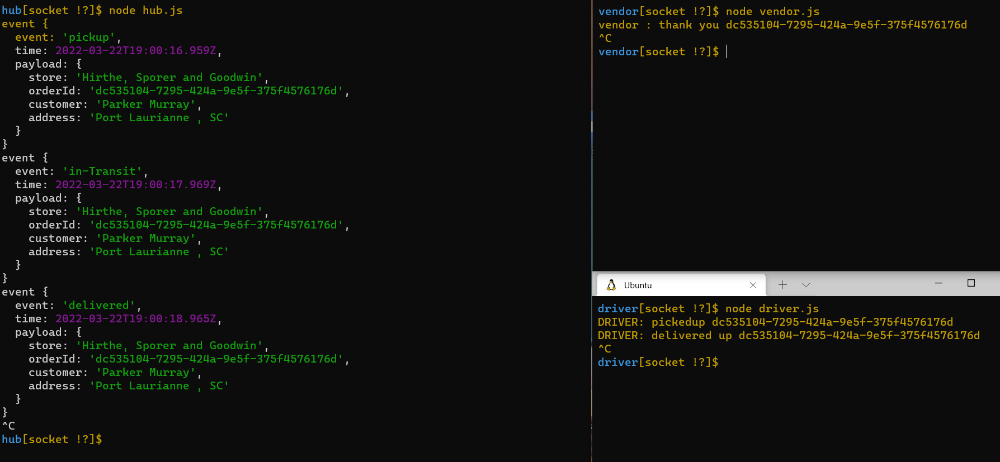
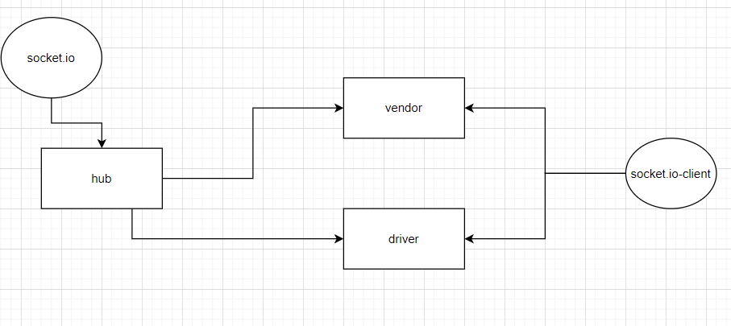

# LAB: Socket.io / caps-socket-io / Branch socket

CAPS Phase 2: Continue working on a multi-day build of our delivery tracking system, creating an event observable over a network with Socket.io.

----------

### **Phase 2 Requirements**

In Phase 2, we’ll be changing the underlying networking implementation of our CAPS system from using node events to using a library called Socket.io so that clients can communicate over a network. Socket.io manages the connection pool for us, making broadcasting much easier to operate, and works well both on the terminal (between servers) and with web clients.

#### ***The following user/developer stories detail the major functionality for this phase of the project.***

- As a vendor, I want to alert the system when I have a package to be picked up.

- As a driver, I want to be notified when there is a package to be delivered.

- As a driver, I want to alert the system when I have picked up a package and it is in transit.

- As a driver, I want to alert the system when a package has been delivered.

- As a vendor, I want to be notified when my package has been delivered.

#### ***And as developers, here is our updated story relevant to the above.***

And as developers, here is our updated story relevant to the above.

- As a developer, I want to create network event driven system using Socket.io so that I can write code that responds to events originating from both servers and client applications.

------------

### in this Applications events we have

#### ***Global Event Pool (HUB)***

1. Use the socket.io npm package to configure an event Server that can be started at a designated port using node.
   - Accept connections on a namespace called caps, and configure socket objects from clients.
   - Ensure that client sockets are connecting to their approriate room if specified.

2. Configure a Global Event Pool that every client socket should listen for:
   - pickup - this will be broadcast to all sockets.
   - in-transit - this will be emitted only to Vendors that have joined the appropriate room.
   - delivered - this will be be emitted only to Vendors that have joined the appropriate room.

#### ***Vendor Client Application***

1. Connects to the CAPS Application Server using socket.io-client:
     - Make sure your module connects using the caps namespace.
     - Upon connection, use a Vendor ID to join a room, this can be a store name.
2. Upon connection, simulate a new customer order:
     - Create a payload object with your store id, order id, customer name, address.
     - Emit that message to the CAPS server with an event called pickup.
3. Listen for the delivered event coming in from the CAPS server.
     - Log “thank you for delivering payload.id to the console.
4.After the delivery event has been received, exit the application using process.exit()

#### ***Driver Client Application***

1. Connects to the CAPS Application Server using socket.io-client:
     - Make sure this module is using the caps namespace to connect to the Server.
2. Once connected, the Driver client module should listen for any appropriate events from the Server:
     - When a pickup is emitted from the Server, simulate all specified Driver behaviors.
3. Simulate the following events and emit payloads to the CAPS Application Server upon receiving a “pickup” event:
     - in-transit
         - Log “picking up payload.id” to the console.
         - emit an in-transit event to the CAPS server with the payload.
     - delivered
         - emit a delivered event to the CAPS server with the payload.

#### ***hub run***

        
----------------

# UML 

----------

- [pull link]()
- [action link]()